# Personal Finance & Schedule Manager

A full-stack, responsive web application designed for freelancers and gig workers to track work schedules, manage expenses, and visualize financial health.

---

## 🚀 Features

### Authentication & Security
* **Secure Registration:** Email/Password registration with OTP verification.
* **Social Login:** Google and GitHub authentication (Passport.js).
* **Session Management:** JWT-based secure sessions.
* **Security:** Rate limiting and data sanitization against NoSQL injection.

### Schedule Management
* **Flexible Tracking:** Add hourly or fixed-salary work schedules.
* **Recurring Schedules:** Support for repeating weekly shifts.
* **Bulk Upload:** Import schedules via Excel/CSV with data validation preview.

### Expense Tracking
* **Daily Logging:** Track expenses with specific categories.
* **Digital Receipts:** Upload and store receipts for record-keeping.

### Interactive Dashboard
* **Real-time KPIs:** View Weekly/Monthly Income, Expenses, and Net Profit instantly.
* **Visualizations:** Interactive charts for income trends and expense breakdowns (Recharts).

### Reporting
* **Export Options:** Generate custom reports in **PDF, CSV, and Excel (XLSX)** formats.
* **Filtering:** Custom date range filtering for precise data export.

---

## 🛠 Tech Stack

### Frontend
* **Framework:** React (Vite) with TypeScript
* **Styling:** Tailwind CSS, Shadcn UI
* **State/Fetching:** TanStack Query (React Query), Context API
* **Forms:** React Hook Form, Zod validation
* **Charts:** Recharts

### Backend
* **Runtime:** Node.js, Express.js
* **Database:** MongoDB (Mongoose ODM)
* **Auth:** Passport.js, JSON Web Token (JWT)
* **Email:** Resend API
* **Files:** Multer (local storage for receipts/uploads)
* **PDF/Excel:** PDFKit, xlsx

### DevOps
* **Containerization:** Docker, Docker Compose
* **Deployment:** Render (or any container-based host)

---

## 📸 Gallery

### Authentication Flow

| Login |
|:---:|
| 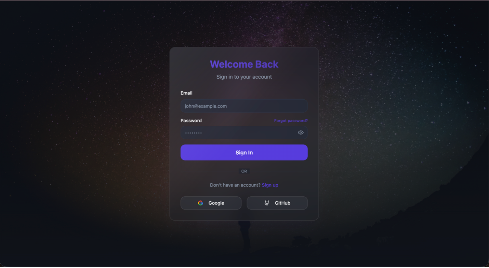 |

| Create Account | Verify-Email |
|:---:|:---:|
| 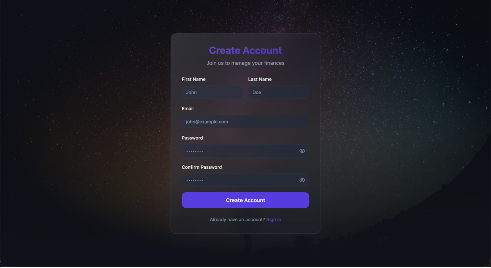 | 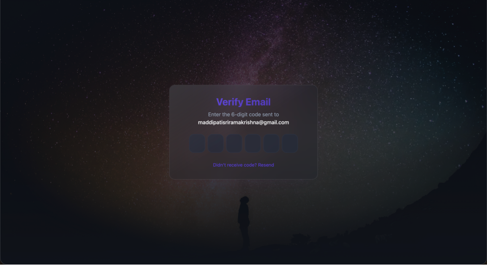 |

### Dashboard View

| Dashboard | Dashboard |
|:---:|:---:|
| 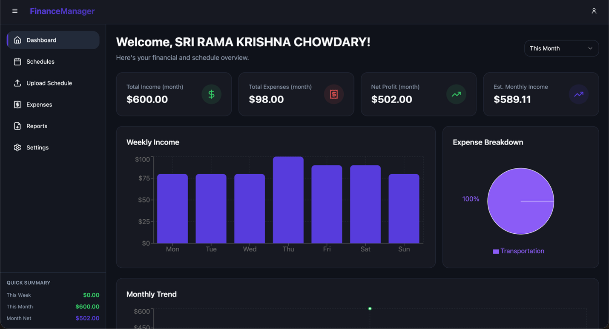 | 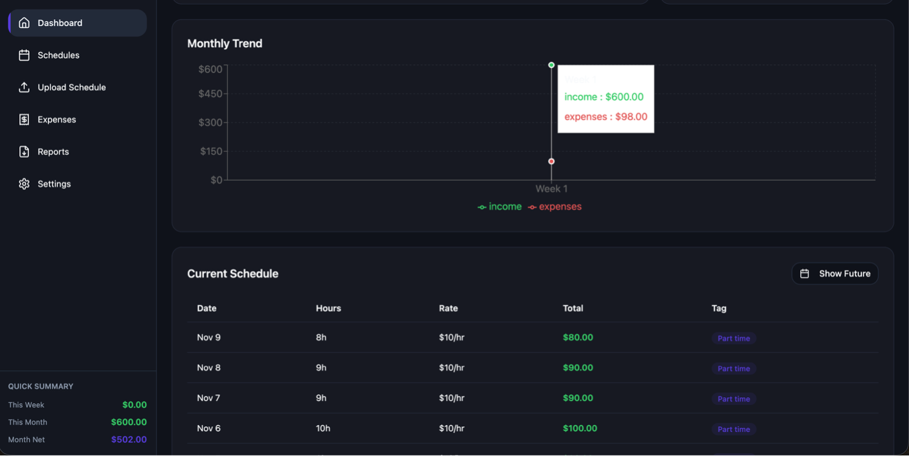 |

### Schedules View

| Schedule Management |
|:---:|
| 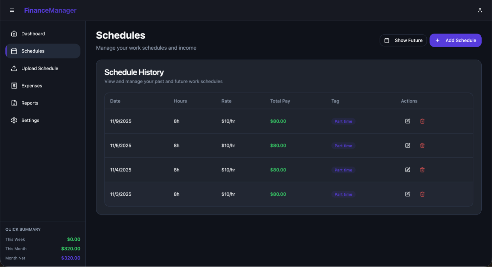 |

| Schedules Adding | Upload Schedules |
|:---:|:---:|
| 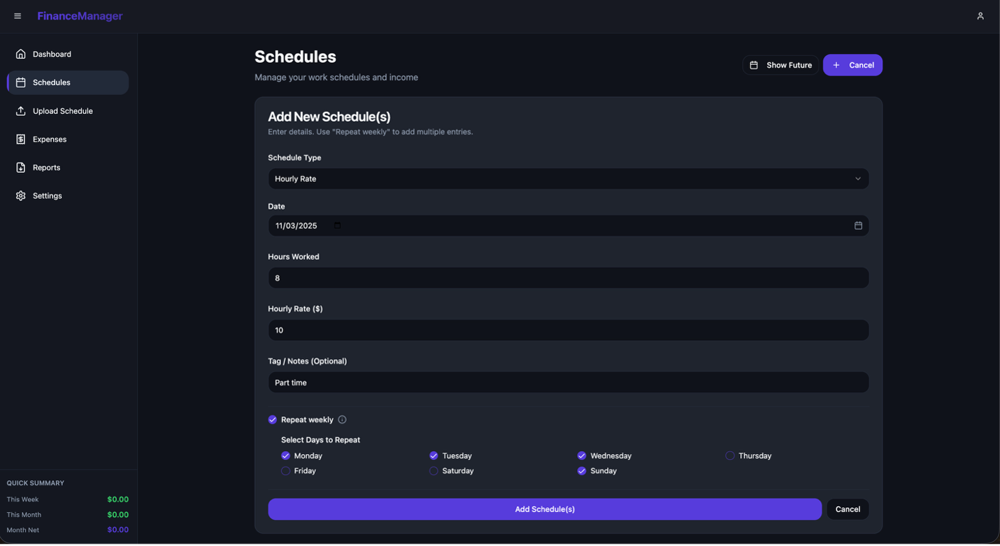 | 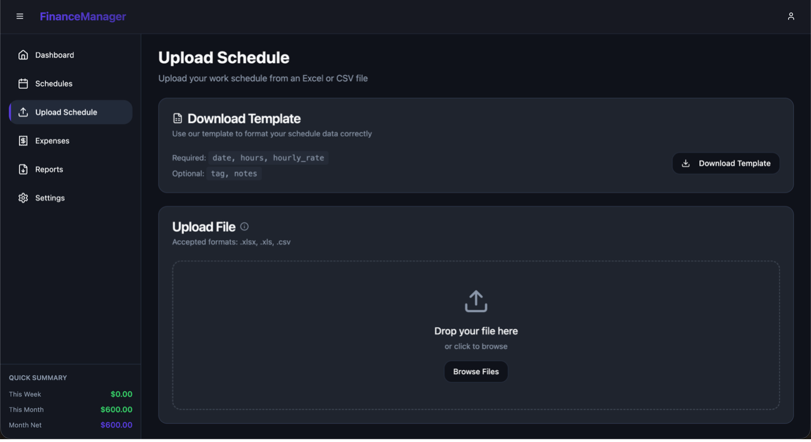 |

### Expenses View

| Expenses Management | Expenses adding |
|:---:|:---:|
| 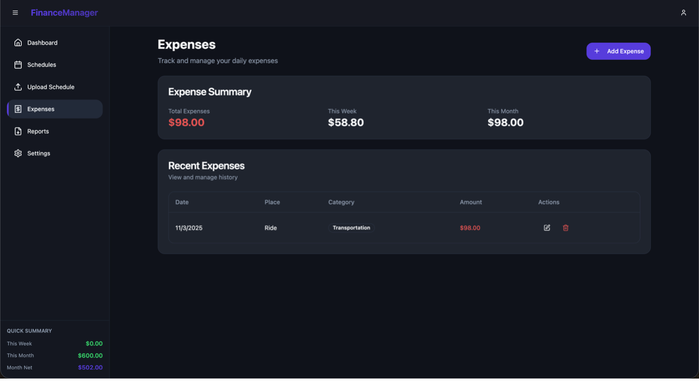 | 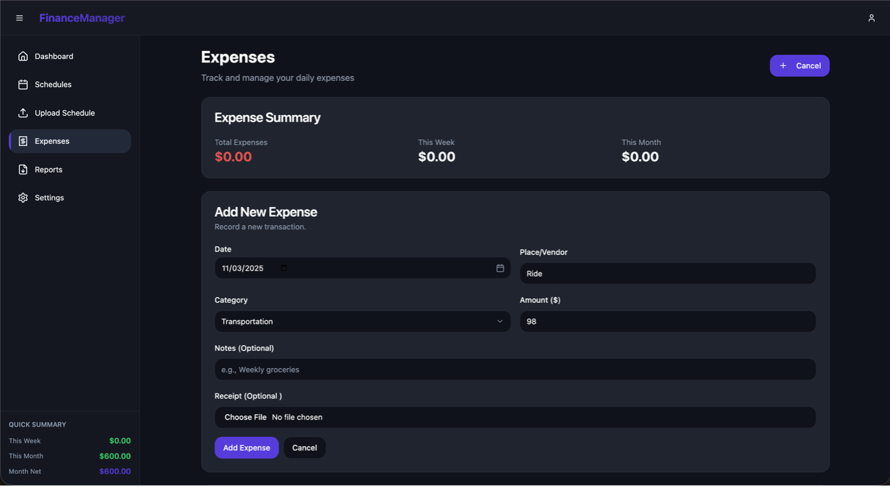 |

### Reports view

| Reports Management |
|:---:|
| 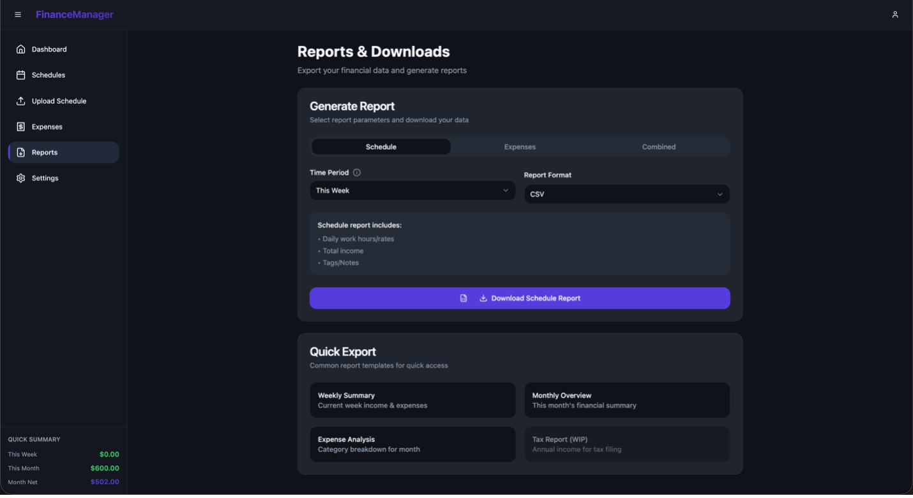 |

### Settings View
| Settings | Settings |
|:---:|:---:|
| 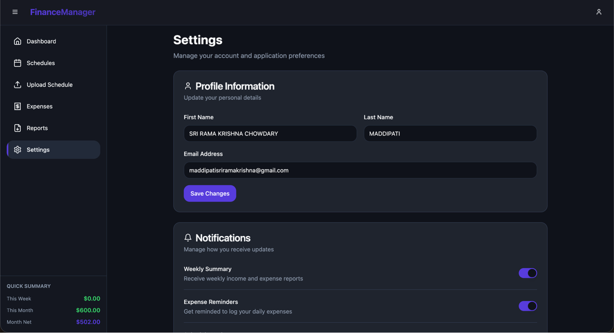 | 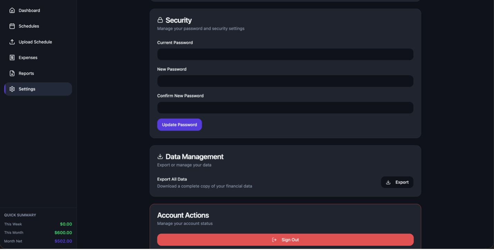 |


---

## 🏁 Getting Started

### Prerequisites
* **Node.js 18+**
* **MongoDB** (Local instance or Atlas URI)
* **Docker Desktop** (Optional, recommended for easiest setup)

### Environment Variables

Create a `.env` file in your `server/` directory with the following configuration:

```env
# --- Server Configuration ---
NODE_ENV=development
PORT=5050
DATABASE_URL=mongodb+srv://your-mongo-uri
JWT_SECRET=your_super_secret_jwt_key
JWT_EXPIRY=7d

# --- External Services ---
RESEND_API_KEY=re_your_resend_key

# --- OAuth (Google/GitHub) ---
GOOGLE_CLIENT_ID=your_google_id
GOOGLE_CLIENT_SECRET=your_google_secret
GITHUB_CLIENT_ID=your_github_id
GITHUB_CLIENT_SECRET=your_github_secret

# --- URLs (Important for CORS and OAuth Redirects) ---
# For local dev without Docker: http://localhost:5173 and http://localhost:5050
# For Docker local: http://localhost:8080 and http://localhost:5050
CLIENT_URL=http://localhost:8080
SERVER_URL=http://localhost:5050
```

### Option 1: Running with Docker (Recommended)

Build and start the entire application (frontend + backend + database networking) with one command:

```bash
docker-compose up --build
```

* **Frontend: http://localhost:8080**

* **Backend API: http://localhost:5050**

### Option 2: Running Locally (Manual)

1. Setup Server

```bash
cd server
npm install 
npm run server
```

2. Setup Client

```bash
cd client
npm install
npm run dev
```

* **Frontend: http://localhost:5173**
  
* **Backend: http://localhost:5050**

### 📖 API Documentation
Full API documentation is available via Swagger UI when the server is running.

* **Local URL: http://localhost:5050/api/docs**

## 📂 Project Structure

```plaintext
├──  client/             # React frontend
│     ├──  src/
│     │     ├──  api/        # Axios setup
│     │     ├──  components/ # Reusable UI components
│     │     ├──  context/    # Auth global state
│     │     ├──  pages/      # Main application views
│     │     └──  lib/        # Utilities (tailwind merge, etc.)
│     └──  Dockerfile
├──  server/             # Express backend
│     ├──  config/         # DB and Passport config
│     ├──  middleware/     # Auth, upload, and error handling
│     ├──  models/         # Mongoose schemas
│     ├──  routes/         # API endpoints
│     ├──  services/       # Email service (Resend)
│     ├──  uploads/        # Local storage for receipts
│     └──  Dockerfile
└──  docker-compose.yml  # Container orchestration
```


